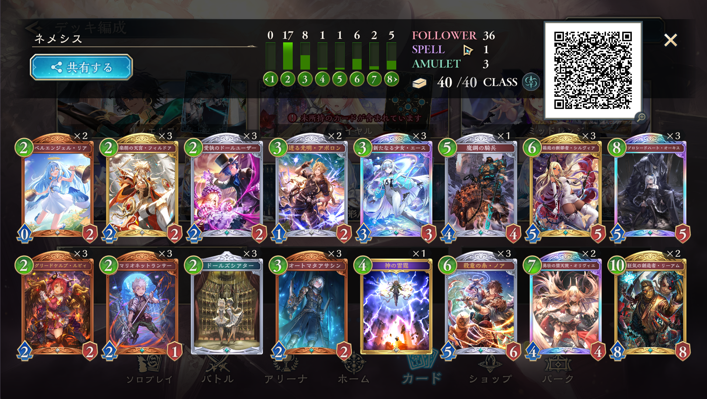

# 人形ネメシス
## リスト

## 動き方
PP通りに動く  
0→2→3→22→23→6  
2→2→3→22→23→6  
0→2→3→22→6→6  

## クラス対策
### エルフ
回復や守護が少ないので序盤から攻める

### ロイヤル
長期戦が見込まれる  
超進化をオリヴィエに切って犬やアマリアの処理範囲を超えることを意識する  
オーキスは手札の操り人形と一緒に使う

### ウィッチ
序盤は攻める
進化ターン以降は守る

### ネメシス(AF)
除去のレパートリーが少ない
体力4以上を並べると勝手に死ぬ

## マリガン
ドールユーザー:単キープ  
ドールズシアター:単キープ?  
エース:EW以外キープ  
ノア:EW以外キープ  
オーキス:EWNm以外キープ/EWは他に揃ってるならキープ  
