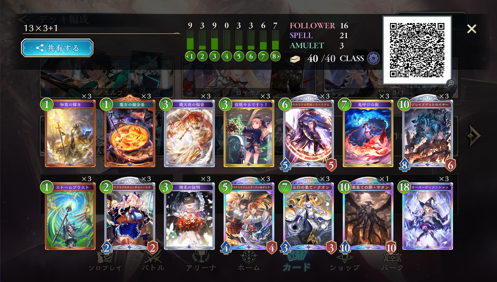
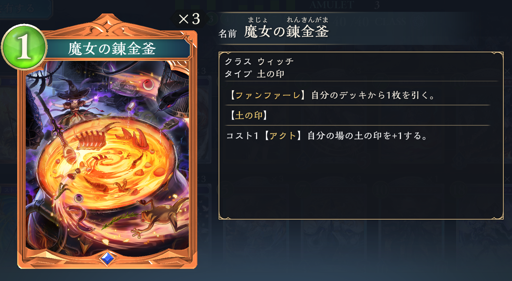
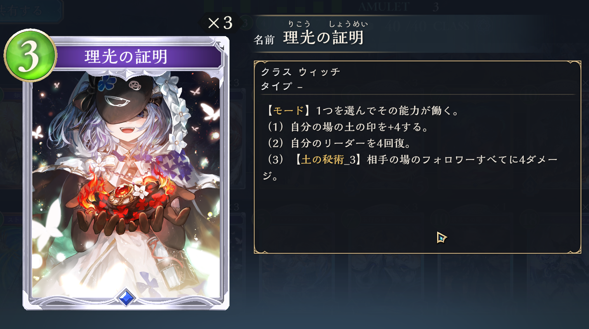

# スペルウィッチ
## リスト
釜入り

## カード解説

気が向いたら増やす  

### 魔女の錬金窯

1コストで1ドローをしてくれる土の印・アミュレット  
理光のAOEモードの存在で理光を3積みできる正当性が生まれる、ドローによって安定性が生まれるといったメリットを持つ  
しかし、スペルウィッチはブレイズデストロイヤーや鬼呼びのコストを下げて盤面を展開する動きが強力なため、盤面をアミュレットで1枚埋めて邪魔をするというのは大きなデメリットである  
クオン投げたら全部埋まるからね  
錬金窯の枠が置き換わるとしたら、ルビィやベルエンジェル、真理の召喚などになる  
ただ、これらのカードは2コストで取り回しがあまり良くないなと感じたため釜を採用  

アクトをすることによって土の印を1増やすことができる  
このスタックは基本的に2で止めておく  
もし3にした場合、次のターンのドローで錬金窯を引くとスタックが4となり理光で消費しきれないため  
次のターンの動きとして知恵理光見えてるとかなら3にしてもいい

### 理光の証明

3コストで4回復できるスペル  
序盤が弱いウィッチにおいて、序盤に殴られた負債を返却できる強力なカード  
打ってる暇があまりないのでオーバーディメンションに絡めたりする  
オーバーディメンションで理光引いてくれば次のターンリーサル逃れるといった場面が多かったため3枚採用  
ただ、3枚積むと事故が起きやすくなる  
そのため、ルビィや釜を採用して3枚採用に正当性を持たせる  

このデッキでは、理光の3つ目のモードのAOEを使うことができる  
先攻4ターン目はあまりやることがないので釜アクト+理光モードと動けると強い  
相手がロイヤルで次スタチウム進化される状況や、エルフでワンツーされるといったまずい状況を返すことができるので必須

## 動きtips
鬼呼びはエンハクオンの打点になるので慎重に使う  
鬼呼び×3+エンハクオンで19点+超進化ぶっとびで20  

後4先5にすぐアングレアを投げるよりも、このターンでスペルブーストして次のターンにブレデス鬼呼びも一緒に投げれるなら1ターン待つ進行もある  
2枚あるなら投げていい  

2ターン目にミラを投げる前に進化可能ターンに投げれるフォロワーがいるか確認する  
いないかつブラストなどで動ける場合、理光モードが見えてる場合などはミラを温存してもいい

クオンは必ずしも超進化を切らないといけないわけではない  
クオン投げると大抵は進化権を切ってくれるので  
+3/3することによって相手の除去ラインを避けることができるかどうか考える  
ウィッチミラーとかなら切った方がいいかも

## 各対面のマリガンと動き方
### エルフ 不利
**共通**　　
知恵、ミラ、3c2ドロー、アングレア、OD  
**先攻**　　
釜+理光  
**後攻**　　
ブレデス/知恵あるならセットでもいい  

後攻は釜が邪魔になりがちなのでキープしなくてもいいかも  
クオン裏ブレデスとか  
そもそも不利なのでハードにマリガンしていい  
先攻は釜+理光が強いので釜キープ  
10まで行って貴人立てれば10点は守れるのでそこで頑張るか、中盤に守護裏ブレデス大展開で勝ち切る  
基本負ける どんまい  
10までに超進化使い切ること多い  
クオン裏ブレデスを目指す  

### ロイヤル 
**共通**　　
知恵、釜、ミラ、3c2ドロー、アングレア、OD  
**先攻**　　
釜+理光、ストブラ  
**後攻**　　
序盤動けるならブレデスや鬼呼び  

アーキタイプが二種類存在するので分けて説明します

#### ミッドレンジロイヤル 微不利～有利(序盤次第)

序盤さえ凌げばなんとかなるので、序盤見れるカードをキープするが、なんとかなることはない  
鬼呼びは処理しつつ面に残ってくれるのでロイヤル対面は強い  
ワルツの5点処理があるのでアングレア進化した時ナイト当たらずに体力6を維持するとよい  
でも多面残ってる場合は取った方がいい  
その場合は大英霊の体力高めにするといいかも  
犬の4点ラインは気にしない  
ウィリアム進化はジェノで取られるのであんまりおすすめしない  
釜+理光ができれば大体勝てるマッチ  

クオン超進化+ブレデスは確実に面が残る  

後4スタチウムされると破産するので先攻は釜を探したい  

#### フェイスロイヤル 不利

カゲミツ入りのフェイスロイヤル  
スタチウムをなんとか返しても打点が無限に飛んでくるので早期決着をするしかない  
アングレア裏にブレデスを置くとかになってくるのだけれども、マリガン時点で相手がどちらなのか不明なので序盤見れるカードない限りブレデスキープはおすすめしない

### ウィッチ 運
**共通**　　
知恵、釜、ミラ、3c2ドロー、アングレア、OD、ウィリアム  
**先攻**  
**後攻**　　
鬼呼び  

運ゲー  
やる意味ない    
基本的に打点はクオンかサタンしかないので超進化は10までに切り切らないようにしましょう  
後攻はクソデカ貴人を置いて捲るしかないのでEPPは温存しておきましょう。16/16以上の貴人を立てれると鬼呼び3枚出してもクオン超進化で取られないので基本的にOTKはなくなります(ODと良い感じのウィリアムが絡むと死ぬ)  
14以上の貴人相手にサタンODしても鬼呼びで当たっておかないと超進化ぶっ飛びできないので微妙  
後4のアングレア2枚持ちの時の1枚目のアングレアには進化を切らない  
先8で盤面を強くしましょう。理光で回復される猶予を与えてしまわないように後8クオン後9エンハクオンで一気に詰めていくムーブがよくあります。それを阻止するために先8で盤面を強くすることで後8が受けのターンとなります。後9で理光ウィリアムで返すと鬼呼びの当て先を作ってしまうことになるうえ、貴人をウィリアムを1枚切った状態で返さなければならないのでキツイです。  
逆に先9は盤面を残さないようにしましょう  
先8で相手が中途半端に盤面を強くしてきたパターンは相手の盤面を残すような処理をするとgood  
サタンOD魔将ラインの10点、悪鬼悪鬼ライン12点を意識するとよいです  

### ドラゴン 守護引ければ有利引けなければ不利
**共通**　　
釜、ブラスト、ミラ、3c2ドロー、アングレア、2コス以下とセットでブレデス  
**先攻**　　
釜+理光  
**後攻**　　

フェイスドラゴン前提  
6のフォルテに合わせて守護立ててたら勝手に勝ちます  
それができなければ負け  
ブレデスを立てることができれば相手は処理に回らないといけないのでキープ寄り  
上手い人がフェイスドラ握ってるパターンあんまりないからしっかり処理して捲るしかない  
アングレア置ければ勝手に息切れしてくれる  

### ナイトメア 不利
**共通**　　
釜、ブラスト、ミラ、3c2ドロー、アングレア、OD  
**先攻**　　
釜+理光  
**後攻**　　
動けるならブレデス

怒りだったりアラガヴィ進化だったりケルベロスだったりの直接打点が多くて厳しいマッチ  
盤面押し付けて処理させることで体力保つとかが難しい  
ケルベロスから出てくるミミココの自壊先を作らないために後7先8で自分の盤面にフォロワーを残したくない。ので、ブラストは余裕があるなら温存してもよいが、序盤テンポ取られないために基本は切る  
先6でアングレアブレデスに対してEXPPを使ってメデューサで対処とかすると次クオン投げてもケルベロス出てこない  
必殺が多いので多面展開、特に4面以上を意識したい

### ビショップ 不利
**共通**　　
知恵、釜、ミラ、3c2ドロー、アングレア、OD  
**先攻**　　
**後攻**　　

疾走入ってる前提  
コントロール相手だったら多分有利  
邪教だったりサレファだったりでAOEが多いので盤面で勝つことが少ない  
マイニュで破産するのでミラ探しに行きたい  
サレファの3点ラインをケアしておくと嫌がってくれる  
ロナヴェロはウィリアム以外にも意外と取れる  
邪教がある以上一気に展開するよりも小出しに継続的に展開を行う  
ジャンヌに合わせて天后進化置きしておくとちょっとお得  
疾走+ジャンヌのターン止めることができないのでまあ不利かな  
10まで行って勝ち切るしかない  

### ネメシス 有利寄り
**共通**　　
釜、ブラスト、ミラ、3c2ドロー、アングレア、OD  
**先攻**　　
エーデルワイス、釜+理光  
**後攻**　　
ブレデス

序盤展開してくるので、ロイヤルと同様に序盤見れるカードを持っておく  
横展開というより2/2とか2/3とか3/3とかの単体が多いのでブラストが強い  
後4アングレア先出しはどの対面も強い

#### AF 五分か微有利
相手のコア、AFはカウントしましょう  
なんか対面みんなβ作ってくるので多面展開すれば相手が破産します。オーキスで返されたらこっちが破産します。  
γ2枚や銃撃、シルヴィアじゃないと対処できないので頑張ってブレデスをいっぱい投げつけましょう  
アングレアに対してアルエットでは回答できないので、アングレアを強く見ます  
ただし、アングレア単体では銃撃で取られるのでアングレア+何かくっつけたい  
Ωに対してはエンハクオン先投げが強いです  
Ωが出るターンに合わせて体力6以上のフォロワーを並べると勝てます  
最近は砲撃入りが多いので中途半端な展開は咎められやすいです  
AFには100%オーキスが入っているので、オーキスのターンには変に展開するよりもオーキスの返しに展開した方が強いです。2枚持ってたら負け  

#### 人形 微有利  
オーキス2枚持ってたら負け  
人形の打点はリーアム進化かオーキス超進化なので、こいつら以外に進化権、超進化権を使わせたい  
なので盤面を展開してオリヴィエやシルヴィアによる処理を強要する展開が望ましい  
オーキス1回リーアム1回くらいなら耐えれる  
進化権を切らせたいので、アングレア裏に鬼呼びを添えるとかする  
クオンに突き合わせて、サタンODで勝つ  
コンシードできる対面  
超進化まで全部切って相手を息切れにさせてサタンのイメージ  

### 総括
ネメシスにギリやれてることによって環境で息をしているが、不利対面が多すぎるので安定して勝つことは不可能  
上振れが強すぎてその時の印象が強く残っているプレイヤーが多いため上位デッキに分類されているが、tier2デッキにすこぶる弱いので立ち位置は厳しい

## 参考
[シャドバビヨンド「伝説の幕開け」環境の釜入りスペルウィッチについて](https://note.com/kt_sv/n/n16995c4b3ab0?sub_rt=share_b)  
[【最新版】最近のスペルウィッチマリガンはこんな感じでやってます【シャドバWB】](https://youtu.be/V-dcq0rUeR0?si=bAtnbsUBSjxmtSLe)